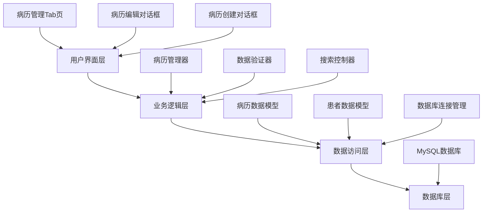
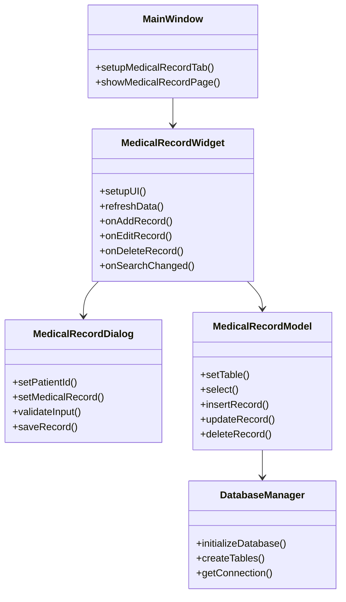
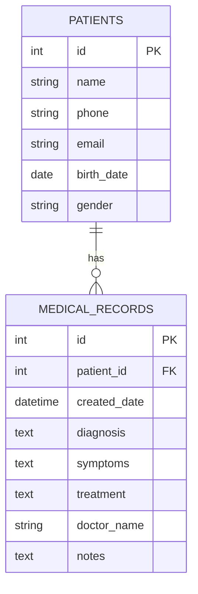

# 病历管理功能设计文档

## 概述

本设计文档描述了在现有Qt C++医院系统中集成病历管理功能的技术实现方案。该功能将采用Qt的Model-View架构，使用MySQL数据库存储病历数据，并与现有患者管理系统无缝集成。

设计遵循Qt最佳实践，使用QSqlTableModel进行数据管理，QTableView进行数据展示，并通过自定义对话框实现病历的创建和编辑功能。系统将连接到MySQL数据库服务器，支持多用户并发访问。

## 架构

### 整体架构

系统采用分层架构设计：



### 模块关系



## 组件和接口

### 1. MedicalRecordWidget 类

主要的病历管理界面组件，负责显示病历列表和处理用户交互。

```cpp
class MedicalRecordWidget : public QWidget
{
    Q_OBJECT

public:
    explicit MedicalRecordWidget(QWidget *parent = nullptr);
    ~MedicalRecordWidget();

public slots:
    void refreshData();
    void onAddRecord();
    void onEditRecord();
    void onDeleteRecord();
    void onSearchChanged(const QString &text);
    void onSelectionChanged();

private slots:
    void onDoubleClicked(const QModelIndex &index);

private:
    void setupUI();
    void setupConnections();
    void updateButtonStates();
    
    Ui::MedicalRecordWidget *ui;
    MedicalRecordModel *m_model;
    QSortFilterProxyModel *m_proxyModel;
    QSqlDatabase m_database;
};
```

### 2. MedicalRecordDialog 类

病历创建和编辑对话框，提供表单界面用于输入病历信息。

```cpp
class MedicalRecordDialog : public QDialog
{
    Q_OBJECT

public:
    enum Mode { Create, Edit };
    
    explicit MedicalRecordDialog(Mode mode, QWidget *parent = nullptr);
    ~MedicalRecordDialog();
    
    void setPatientId(int patientId);
    void setMedicalRecord(const MedicalRecord &record);
    MedicalRecord getMedicalRecord() const;

private slots:
    void onPatientChanged();
    void onSaveClicked();
    void onCancelClicked();

private:
    void setupUI();
    void setupValidation();
    void loadPatients();
    void loadPatientInfo(int patientId);
    bool validateInput();
    
    Ui::MedicalRecordDialog *ui;
    Mode m_mode;
    MedicalRecord m_record;
    QSqlDatabase m_database;
};
```

### 3. MedicalRecordModel 类

继承自QSqlTableModel，负责病历数据的管理和数据库操作。

```cpp
class MedicalRecordModel : public QSqlTableModel
{
    Q_OBJECT

public:
    enum Column {
        Id = 0,
        PatientId,
        PatientName,
        CreatedDate,
        Diagnosis,
        Symptoms,
        Treatment,
        DoctorName,
        Notes,
        ColumnCount
    };

    explicit MedicalRecordModel(QObject *parent = nullptr, QSqlDatabase db = QSqlDatabase());
    
    // QAbstractItemModel interface
    QVariant data(const QModelIndex &index, int role = Qt::DisplayRole) const override;
    QVariant headerData(int section, Qt::Orientation orientation, int role = Qt::DisplayRole) const override;
    
    // Custom methods
    bool insertMedicalRecord(const MedicalRecord &record);
    bool updateMedicalRecord(int id, const MedicalRecord &record);
    bool deleteMedicalRecord(int id);
    MedicalRecord getMedicalRecord(int row) const;

private:
    void setupModel();
};
```

### 4. MedicalRecord 数据结构

```cpp
struct MedicalRecord
{
    int id;
    int patientId;
    QString patientName;
    QDateTime createdDate;
    QString diagnosis;
    QString symptoms;
    QString treatment;
    QString doctorName;
    QString notes;
    
    MedicalRecord() : id(-1), patientId(-1) {}
    
    bool isValid() const {
        return patientId > 0 && !diagnosis.isEmpty() && !doctorName.isEmpty();
    }
};
```

### 5. DatabaseManager 类

管理数据库连接和表结构初始化。

```cpp
class DatabaseManager
{
public:
    static DatabaseManager& instance();
    
    bool initializeDatabase(const QString &host, const QString &dbName, 
                           const QString &username, const QString &password, int port = 3306);
    QSqlDatabase getConnection() const;
    bool createMedicalRecordTable();
    bool testConnection();
    
private:
    DatabaseManager() = default;
    QSqlDatabase m_database;
    bool m_initialized = false;
    QString m_connectionName;
};
```

## 数据模型

### 数据库表结构

#### medical_records 表

```sql
CREATE TABLE medical_records (
    id INT AUTO_INCREMENT PRIMARY KEY,
    patient_id INT NOT NULL,
    created_date DATETIME DEFAULT CURRENT_TIMESTAMP,
    diagnosis TEXT NOT NULL,
    symptoms TEXT,
    treatment TEXT,
    doctor_name VARCHAR(100) NOT NULL,
    notes TEXT,
    INDEX idx_patient_id (patient_id),
    INDEX idx_created_date (created_date),
    INDEX idx_doctor_name (doctor_name),
    FOREIGN KEY (patient_id) REFERENCES patients(id) ON DELETE CASCADE
) ENGINE=InnoDB DEFAULT CHARSET=utf8mb4 COLLATE=utf8mb4_unicode_ci;
```

#### 索引设计

MySQL表创建时已包含必要的索引：

```sql
-- 患者ID索引（已在表创建时定义）
-- CREATE INDEX idx_patient_id ON medical_records(patient_id);

-- 创建日期索引（已在表创建时定义）  
-- CREATE INDEX idx_created_date ON medical_records(created_date);

-- 医生姓名索引（已在表创建时定义）
-- CREATE INDEX idx_doctor_name ON medical_records(doctor_name);

-- 可选：复合索引用于复杂查询
CREATE INDEX idx_patient_date ON medical_records(patient_id, created_date);
```

### 数据关系



### 数据验证规则

1. **必填字段验证**
   - patient_id: 必须是有效的患者ID
   - diagnosis: 不能为空，最大长度500字符
   - doctor_name: 不能为空，最大长度100字符

2. **可选字段验证**
   - symptoms: 最大长度1000字符
   - treatment: 最大长度1000字符
   - notes: 最大长度2000字符

3. **业务规则验证**
   - 创建日期自动设置为当前时间
   - 患者ID必须在patients表中存在
   - 同一患者可以有多条病历记录

## 用户界面设计

### 主界面集成

病历管理标签页将插入到现有的主界面标签栏中，位于"患者管理"和"预约管理"之间。

```cpp
// 在MainWindow的setupUI方法中添加
void MainWindow::setupMedicalRecordTab()
{
    // 初始化数据库连接
    DatabaseManager::instance().initializeDatabase(
        "localhost",        // 主机地址
        "hospital_db",      // 数据库名
        "hospital_user",    // 用户名
        "password",         // 密码
        3306               // 端口
    );
    
    m_medicalRecordWidget = new MedicalRecordWidget(this);
    
    // 在患者管理和预约管理之间插入病历管理标签
    int insertIndex = ui->tabWidget->indexOf(ui->appointmentTab);
    ui->tabWidget->insertTab(insertIndex, m_medicalRecordWidget, "病历管理");
}
```

### 病历列表界面

```
┌─────────────────────────────────────────────────────────────────┐
│ 病历管理                                                        │
├─────────────────────────────────────────────────────────────────┤
│ 搜索: [________________] [添加病历] [编辑] [删除]                │
├─────────────────────────────────────────────────────────────────┤
│ 病历ID │ 患者姓名 │ 创建日期    │ 诊断        │ 医生     │      │
├─────────────────────────────────────────────────────────────────┤
│ 001    │ 张三     │ 2024-01-15  │ 感冒        │ 李医生   │      │
│ 002    │ 李四     │ 2024-01-16  │ 高血压      │ 王医生   │      │
│ 003    │ 王五     │ 2024-01-17  │ 糖尿病      │ 李医生   │      │
└─────────────────────────────────────────────────────────────────┘
```

### 病历编辑对话框

```
┌─────────────────────────────────────────────────────────────────┐
│ 病历信息                                              [×]       │
├─────────────────────────────────────────────────────────────────┤
│ 患者信息:                                                       │
│ 患者: [张三 ▼]  年龄: 35  性别: 男  电话: 138****1234          │
├─────────────────────────────────────────────────────────────────┤
│ 病历信息:                                                       │
│ 诊断: [_________________________________]                      │
│ 症状: [_________________________________]                      │
│       [_________________________________]                      │
│ 治疗方案: [_____________________________]                      │
│           [_____________________________]                      │
│ 医生姓名: [_____________________________]                      │
│ 备注: [_________________________________]                      │
│       [_________________________________]                      │
├─────────────────────────────────────────────────────────────────┤
│                                    [保存] [取消]                │
└─────────────────────────────────────────────────────────────────┘
```

## 错误处理

### 数据库错误处理

```cpp
class DatabaseErrorHandler
{
public:
    static void handleSqlError(const QSqlError &error, const QString &operation);
    static bool showRetryDialog(const QString &message);
    
private:
    static void logError(const QSqlError &error, const QString &operation);
};
```

### 错误类型和处理策略

1. **连接错误**
   - 显示友好的错误消息
   - 提供重试选项
   - 记录详细错误日志

2. **数据验证错误**
   - 高亮显示错误字段
   - 显示具体的验证消息
   - 阻止保存操作

3. **外键约束错误**
   - 检查关联的患者是否存在
   - 提供创建新患者的选项
   - 显示清晰的错误说明

### 异常安全保证

```cpp
bool MedicalRecordModel::insertMedicalRecord(const MedicalRecord &record)
{
    QSqlDatabase::database().transaction();
    
    try {
        // 执行插入操作
        QSqlQuery query;
        query.prepare("INSERT INTO medical_records (patient_id, diagnosis, symptoms, treatment, doctor_name, notes) "
                     "VALUES (?, ?, ?, ?, ?, ?)");
        
        query.addBindValue(record.patientId);
        query.addBindValue(record.diagnosis);
        query.addBindValue(record.symptoms);
        query.addBindValue(record.treatment);
        query.addBindValue(record.doctorName);
        query.addBindValue(record.notes);
        
        if (!query.exec()) {
            QSqlDatabase::database().rollback();
            DatabaseErrorHandler::handleSqlError(query.lastError(), "插入病历记录");
            return false;
        }
        
        QSqlDatabase::database().commit();
        select(); // 刷新模型数据
        return true;
        
    } catch (...) {
        QSqlDatabase::database().rollback();
        throw;
    }
}
```

## 测试策略

### 单元测试

使用Qt Test框架进行单元测试，重点测试：

1. **数据模型测试**
   - 数据插入、更新、删除操作
   - 数据验证逻辑
   - 错误处理机制

2. **业务逻辑测试**
   - 病历创建和编辑流程
   - 搜索和过滤功能
   - 数据关联性验证

### 集成测试

1. **数据库集成测试**
   - 表结构创建和迁移
   - 外键约束验证
   - 事务处理测试

2. **用户界面集成测试**
   - 界面组件交互
   - 数据绑定验证
   - 用户操作流程测试

### 性能测试

1. **数据加载性能**
   - 大量数据的加载时间
   - 搜索响应时间
   - 内存使用情况

2. **并发操作测试**
   - 多用户同时操作
   - 数据一致性验证
   - 锁机制测试

## 正确性属性

*属性是一个特征或行为，应该在系统的所有有效执行中保持为真——本质上是关于系统应该做什么的正式声明。属性作为人类可读规范和机器可验证正确性保证之间的桥梁。*

基于需求分析，以下是病历管理系统的关键正确性属性：

### 属性 1: 患者删除级联操作
*对于任何* 患者和其关联的病历记录，当删除该患者时，系统应当自动删除该患者的所有病历记录
**验证需求: Requirements 1.3**

### 属性 2: 病历创建完整性
*对于任何* 有效的病历信息，当创建病历记录时，系统应当自动生成唯一的病历ID和创建时间戳，并成功保存到数据库
**验证需求: Requirements 1.5, 4.5**

### 属性 3: 病历编辑保持一致性
*对于任何* 现有的病历记录，当编辑并保存时，系统应当更新数据库中的记录并在UI中反映这些更改
**验证需求: Requirements 5.2, 5.4**

### 属性 4: 病历删除操作完整性
*对于任何* 选中的病历记录，当确认删除时，系统应当从数据库中永久删除该记录并更新UI显示
**验证需求: Requirements 6.3, 6.4**

### 属性 5: 数据变更后UI自动刷新
*对于任何* 数据变更操作（创建、编辑、删除），系统应当自动刷新病历列表显示以反映最新状态
**验证需求: Requirements 3.2, 6.4**

### 属性 6: 表格排序功能
*对于任何* 可排序的表格列，点击列标题应当按该列的值对所有病历记录进行排序
**验证需求: Requirements 3.4**

### 属性 7: 患者信息关联显示
*对于任何* 选择的患者，系统应当正确显示该患者的姓名、年龄、性别和联系方式
**验证需求: Requirements 4.3, 9.1**

### 属性 8: 综合搜索功能
*对于任何* 搜索关键词，系统应当实时过滤病历列表，支持按患者姓名、诊断信息、医生姓名进行不区分大小写的部分匹配
**验证需求: Requirements 7.1, 7.2, 7.5**

### 属性 9: 数据验证完整性
*对于任何* 病历数据输入，系统应当验证必填字段不为空，检查字段长度限制，并在验证失败时显示错误消息并阻止保存
**验证需求: Requirements 8.1, 8.2, 8.3, 8.4, 8.5**

### 属性 10: 患者信息同步更新
*对于任何* 患者信息的更改，系统应当在所有相关的病历显示中反映这些更新
**验证需求: Requirements 9.4**

### 属性 11: 删除患者后病历标记
*对于任何* 被删除的患者，其相关的病历记录应当在列表中显示"患者已删除"标记
**验证需求: Requirements 9.5**

## 错误处理

### 错误分类和处理策略

#### 1. 数据库连接错误
- **错误类型**: MySQL服务器不可达、认证失败、网络超时、数据库不存在
- **处理策略**: 
  - 显示用户友好的错误消息
  - 提供重试机制和连接配置选项
  - 记录详细的错误日志
  - 在可能的情况下提供解决建议
  - 实现连接池管理避免频繁连接

```cpp
void DatabaseManager::handleConnectionError(const QSqlError &error)
{
    QString userMessage;
    QString logMessage = QString("MySQL数据库连接失败: %1").arg(error.text());
    
    switch (error.type()) {
    case QSqlError::ConnectionError:
        if (error.nativeErrorCode() == "2003") {
            userMessage = "无法连接到MySQL服务器。请检查服务器是否运行且网络连接正常。";
        } else if (error.nativeErrorCode() == "1045") {
            userMessage = "数据库认证失败。请检查用户名和密码是否正确。";
        } else if (error.nativeErrorCode() == "1049") {
            userMessage = "指定的数据库不存在。请联系系统管理员创建数据库。";
        } else {
            userMessage = "无法连接到数据库服务器。请检查连接配置。";
        }
        break;
    case QSqlError::StatementError:
        userMessage = "数据库操作失败。请稍后重试。";
        break;
    default:
        userMessage = "发生未知的数据库错误。请联系系统管理员。";
    }
    
    // 记录错误日志
    qCritical() << logMessage;
    
    // 显示用户消息和重试选项
    QMessageBox msgBox;
    msgBox.setIcon(QMessageBox::Critical);
    msgBox.setWindowTitle("数据库连接错误");
    msgBox.setText(userMessage);
    msgBox.addButton("重试", QMessageBox::AcceptRole);
    msgBox.addButton("配置连接", QMessageBox::ActionRole);
    msgBox.addButton("取消", QMessageBox::RejectRole);
    
    int result = msgBox.exec();
    if (result == 0) {
        // 重试连接
        retryConnection();
    } else if (result == 1) {
        // 打开连接配置对话框
        showConnectionConfigDialog();
    }
}
```

#### 2. 数据验证错误
- **错误类型**: 必填字段为空、字段长度超限、数据格式不正确
- **处理策略**:
  - 高亮显示错误字段
  - 显示具体的验证消息
  - 阻止保存操作
  - 保持对话框打开以便用户修正

```cpp
bool MedicalRecordDialog::validateInput()
{
    QStringList errors;
    
    // 验证必填字段
    if (ui->patientComboBox->currentData().toInt() <= 0) {
        errors << "请选择患者";
        ui->patientComboBox->setStyleSheet("border: 2px solid red;");
    }
    
    if (ui->diagnosisEdit->text().trimmed().isEmpty()) {
        errors << "诊断信息不能为空";
        ui->diagnosisEdit->setStyleSheet("border: 2px solid red;");
    } else if (ui->diagnosisEdit->text().length() > 500) {
        errors << "诊断信息不能超过500个字符";
        ui->diagnosisEdit->setStyleSheet("border: 2px solid red;");
    }
    
    if (ui->doctorNameEdit->text().trimmed().isEmpty()) {
        errors << "医生姓名不能为空";
        ui->doctorNameEdit->setStyleSheet("border: 2px solid red;");
    }
    
    // 验证字段长度
    if (ui->symptomsEdit->toPlainText().length() > 1000) {
        errors << "症状描述不能超过1000个字符";
        ui->symptomsEdit->setStyleSheet("border: 2px solid red;");
    }
    
    if (ui->treatmentEdit->toPlainText().length() > 1000) {
        errors << "治疗方案不能超过1000个字符";
        ui->treatmentEdit->setStyleSheet("border: 2px solid red;");
    }
    
    if (!errors.isEmpty()) {
        QString message = "请修正以下错误:\n" + errors.join("\n");
        QMessageBox::warning(this, "输入验证", message);
        return false;
    }
    
    return true;
}
```

#### 3. 外键约束错误
- **错误类型**: 引用的患者不存在、级联删除失败
- **处理策略**:
  - 检查数据完整性
  - 提供数据修复选项
  - 显示清晰的错误说明

```cpp
bool MedicalRecordModel::insertMedicalRecord(const MedicalRecord &record)
{
    // 首先验证患者是否存在
    QSqlQuery checkQuery;
    checkQuery.prepare("SELECT COUNT(*) FROM patients WHERE id = ?");
    checkQuery.addBindValue(record.patientId);
    
    if (!checkQuery.exec() || !checkQuery.next() || checkQuery.value(0).toInt() == 0) {
        QMessageBox::warning(nullptr, "数据错误", 
                           QString("患者ID %1 不存在。请选择有效的患者。").arg(record.patientId));
        return false;
    }
    
    // 开始事务
    QSqlDatabase db = QSqlDatabase::database();
    if (!db.transaction()) {
        qWarning() << "无法开始数据库事务:" << db.lastError().text();
        return false;
    }
    
    // 执行插入操作
    QSqlQuery insertQuery;
    insertQuery.prepare("INSERT INTO medical_records (patient_id, diagnosis, symptoms, treatment, doctor_name, notes) "
                       "VALUES (?, ?, ?, ?, ?, ?)");
    
    insertQuery.addBindValue(record.patientId);
    insertQuery.addBindValue(record.diagnosis);
    insertQuery.addBindValue(record.symptoms);
    insertQuery.addBindValue(record.treatment);
    insertQuery.addBindValue(record.doctorName);
    insertQuery.addBindValue(record.notes);
    
    if (!insertQuery.exec()) {
        db.rollback();
        DatabaseManager::handleSqlError(insertQuery.lastError(), "创建病历记录");
        return false;
    }
    
    // 提交事务
    if (!db.commit()) {
        db.rollback();
        qWarning() << "无法提交数据库事务:" << db.lastError().text();
        return false;
    }
    
    select(); // 刷新模型
    return true;
}
```

#### 4. 并发访问错误
- **错误类型**: 数据库锁定、记录被其他用户修改
- **处理策略**:
  - 实现乐观锁机制
  - 提供冲突解决选项
  - 自动重试机制

### 异常安全保证

系统提供强异常安全保证：

1. **事务完整性**: 所有数据库操作都在事务中执行，确保原子性
2. **资源管理**: 使用RAII模式管理数据库连接和查询对象
3. **状态一致性**: 操作失败时系统状态保持不变
4. **内存安全**: 使用智能指针和Qt的对象树管理内存

## 测试策略

### 双重测试方法

病历管理系统采用单元测试和基于属性的测试相结合的方法：

- **单元测试**: 验证具体示例、边界情况和错误条件
- **属性测试**: 验证跨所有输入的通用属性
- 两者互补，确保全面覆盖

### 单元测试重点

单元测试专注于：
- 具体的功能示例验证
- 组件间的集成点
- 边界情况和错误条件
- UI组件的存在性和布局验证

示例单元测试：
```cpp
void TestMedicalRecordWidget::testUIComponents()
{
    MedicalRecordWidget widget;
    
    // 验证必要的UI组件存在
    QVERIFY(widget.findChild<QLineEdit*>("searchEdit") != nullptr);
    QVERIFY(widget.findChild<QPushButton*>("addButton") != nullptr);
    QVERIFY(widget.findChild<QPushButton*>("editButton") != nullptr);
    QVERIFY(widget.findChild<QPushButton*>("deleteButton") != nullptr);
    QVERIFY(widget.findChild<QTableView*>("tableView") != nullptr);
}

void TestMedicalRecordDialog::testEmptySearchResult()
{
    MedicalRecordWidget widget;
    QLineEdit *searchEdit = widget.findChild<QLineEdit*>("searchEdit");
    
    // 输入不存在的搜索关键词
    searchEdit->setText("不存在的关键词12345");
    
    // 验证显示空结果消息
    QLabel *messageLabel = widget.findChild<QLabel*>("messageLabel");
    QVERIFY(messageLabel->text().contains("未找到匹配的病历记录"));
}
```

### 基于属性的测试配置

使用Qt Test框架结合自定义属性测试工具：
- 每个属性测试最少运行100次迭代
- 每个测试必须引用其设计文档属性
- 标签格式: **Feature: medical-record-management, Property {number}: {property_text}**

示例属性测试：
```cpp
void TestMedicalRecordModel::testPatientDeletionCascade()
{
    // Feature: medical-record-management, Property 1: 患者删除级联操作
    
    for (int i = 0; i < 100; ++i) {
        // 生成随机患者和病历数据
        Patient randomPatient = generateRandomPatient();
        QList<MedicalRecord> randomRecords = generateRandomMedicalRecords(randomPatient.id);
        
        // 插入测试数据
        insertPatient(randomPatient);
        for (const auto &record : randomRecords) {
            insertMedicalRecord(record);
        }
        
        // 删除患者
        deletePatient(randomPatient.id);
        
        // 验证所有相关病历记录都被删除
        QSqlQuery query;
        query.prepare("SELECT COUNT(*) FROM medical_records WHERE patient_id = ?");
        query.addBindValue(randomPatient.id);
        query.exec();
        query.next();
        
        QCOMPARE(query.value(0).toInt(), 0);
        
        // 清理测试数据
        cleanupTestData();
    }
}

void TestMedicalRecordWidget::testSearchFunctionality()
{
    // Feature: medical-record-management, Property 8: 综合搜索功能
    
    for (int i = 0; i < 100; ++i) {
        // 生成随机病历数据
        QList<MedicalRecord> testRecords = generateRandomMedicalRecords();
        insertTestRecords(testRecords);
        
        // 随机选择搜索字段和关键词
        MedicalRecord randomRecord = testRecords[QRandomGenerator::global()->bounded(testRecords.size())];
        QStringList searchFields = {randomRecord.patientName, randomRecord.diagnosis, randomRecord.doctorName};
        QString searchKeyword = searchFields[QRandomGenerator::global()->bounded(searchFields.size())];
        
        // 执行搜索
        widget->search(searchKeyword.toLower()); // 测试不区分大小写
        
        // 验证搜索结果
        QList<MedicalRecord> results = widget->getDisplayedRecords();
        for (const auto &result : results) {
            bool matches = result.patientName.contains(searchKeyword, Qt::CaseInsensitive) ||
                          result.diagnosis.contains(searchKeyword, Qt::CaseInsensitive) ||
                          result.doctorName.contains(searchKeyword, Qt::CaseInsensitive);
            QVERIFY(matches);
        }
        
        cleanupTestData();
    }
}
```

### 测试数据生成

为属性测试提供随机数据生成器：

```cpp
class TestDataGenerator
{
public:
    static Patient generateRandomPatient();
    static MedicalRecord generateRandomMedicalRecord(int patientId = -1);
    static QList<MedicalRecord> generateRandomMedicalRecords(int patientId = -1, int count = -1);
    static QString generateRandomString(int minLength, int maxLength);
    static QString generateRandomChineseText(int length);
    
private:
    static QStringList s_patientNames;
    static QStringList s_doctorNames;
    static QStringList s_diagnoses;
    static QStringList s_symptoms;
    static QStringList s_treatments;
};
```

### 集成测试

集成测试验证：
1. 数据库表创建和迁移
2. 外键约束和级联删除
3. UI组件与数据模型的绑定
4. 跨组件的数据流

### 性能测试

性能测试关注：
1. 大量数据加载时间（1000+记录）
2. 搜索响应时间
3. 内存使用情况
4. 并发操作处理能力

每个正确性属性都必须通过相应的属性测试实现，确保系统在各种输入条件下的正确行为。